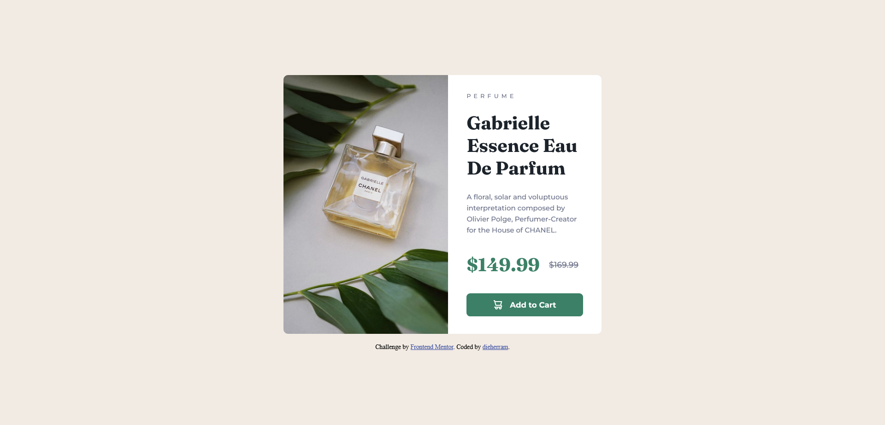

# Desafío Product Preview Card Component 📦 de Frontend Mentor 😎

## Overview 🚀
¡Hola! Este es mi intento de replicar el diseño de la tarjeta de vista previa de producto. El desafío consistió en crear un componente de tarjeta y hacer que se vea lo más parecido posible al diseño original en diferentes dispositivos.

## Screenshots 📸
### Escritorio

### Móvil

### Links

- Ver solución: [GitHub Pages](https://dieherram.github.io/fem-product-preview-card-component/)

## My Process 💻
Mi enfoque fue organizar primero el HTML y luego aplicar estilos con CSS, utilizando Flexbox para estructurar el contenido y hacerlo responsivo.

## Built With 🛠️
- HTML5
- CSS
- Flexbox

## What I Learned 🤓
Este proyecto fue una gran oportunidad para fortalecer mis habilidades en HTML y CSS, especialmente en la creación de diseños responsivos.

## Continued Development 🚧
Mi próximo paso es profundizar en CSS Grid. Quiero dominar las cuadrículas y llevar mis habilidades de diseño al siguiente nivel.

## Author

- GitHub - [dieherram](https://github.com/dieherram)
- Frontend Mentor - [@dieherram](https://www.frontendmentor.io/profile/dieherram)
- Codewars - [@dieherram](https://www.codewars.com/users/dieherram)
- LinkedIn - [Diego Hernández Ramos](https://www.linkedin.com/in/diego-hernandez-ramos/)

## Acknowledgments 🙌
Agradezco a Frontend Mentor por proporcionar desafíos que nos permiten mejorar nuestras habilidades. ¡También a la increíble comunidad de desarrolladores! 🌟